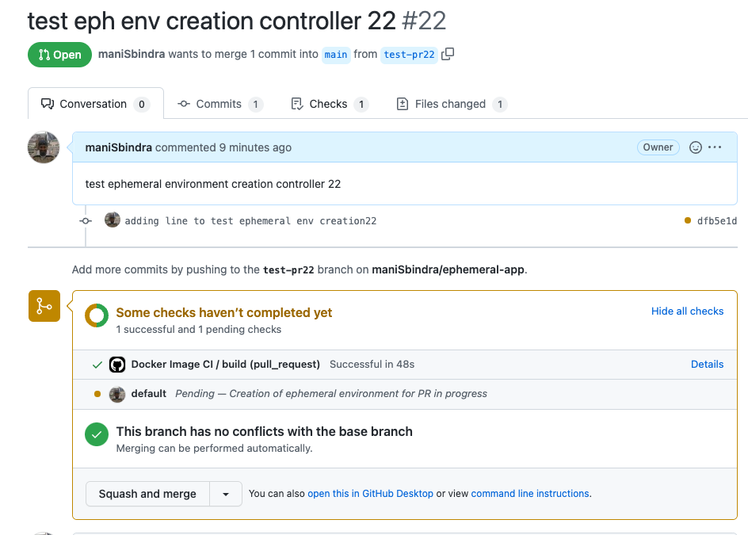
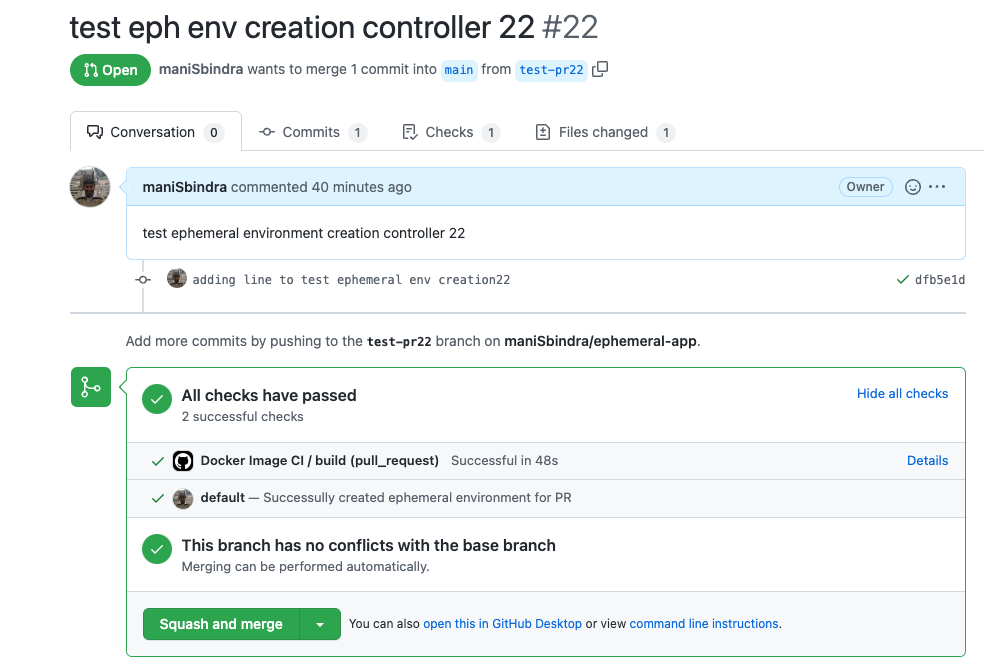
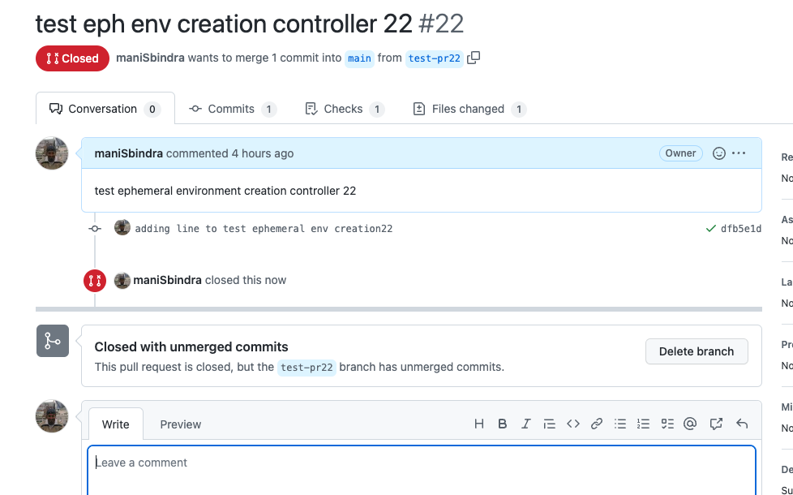

# Ephemeral Environment Setup using Custom Controller, Flux , Crossplane Azure Jet Provider, and Crossplane Helm Provider

## Overview
This setup is to create a Kind Cluster and create the [pr-ephemeral-env-controller controller](https://github.com/maniSbindra/pr-ephemeral-env-controller) on the Cluster. A [PREphemeralEnvController Resource](./ephemeral-prcontroller-CR.yaml) is also created on the cluster. Once the controller and PREphemeralEnvController resource are created the controller creates (updates / deletes) a new Ephmeral environment for each PR to the [sample application repository](https://github.com/maniSbindra/ephemeral-app), which is a simple todo API (CRUD for todo items), the tech stack is Java / Springboot, and the application needs a backend postgres database. In this case an isolated environment is created for each PR, which includes a new resource group, a new AKS cluster to which the application deployment and service (corresponding to the PR SHA commit of the application) are applied, a new Azure Postgres backend database to which the application points to read and persist data.
The Environment created is based on the spec.envCreationHelmRepo setting, which points to a helm chart based on which the environment is created. The Helm Chart repo for the configurations shown in current sample is [pr-ephemeral-env-controller](https://github.com/maniSbindra/pr-ephemeral-env-controller)

## Installation and Setup

The script [setup-mgmt-cluster_with_flux.sh](https://github.com/maniSbindra/ephemeral-mgmt/blob/main/mgmt-server-install-with-flux/setup-mgmt-cluster_with_flux.sh) is used to setup the management cluster. Following are the prerequisites before installing this script:

## Pre-requisites

* Kind is setup on your machine
* kubectl client is installed
* helm client is installed
* kubectl crossplane plugin is installed: You can refer steps mentioned at [install crossplane](https://crossplane.io/docs/v1.9/getting-started/install-configure.html)
* Flux CLI is installed : [Install Flux CLI](https://fluxcd.io/flux/installation/)
* Additionally we also need to create creds.json file in the same directory as the script using the command.
    ```
    az ad sp create-for-rbac --role Contributor --scopes /subscriptions/xxxxxxxx-xxxx-xxxx-xxxx-xxxxxxxxxxxx > "creds.json"
    ```
  This service principal is used by the Crossplane Azure jet provider to provision Azure resource. For more information regarding the service principal creation please see the [crossplane documentation](https://crossplane.io/docs/v1.9/getting-started/install-configure.html#get-azure-principal-keyfile)

## Setup the Management Cluster

* Clone the repo 

  ```
  git clone https://github.com/maniSbindra/ephemeral-mgmt.git
  ```

* Give script execute permissions
  ```
  cd mgmt-server-install-with-flux
  chmod +x setup-mgmt-cluster_with_flux.sh
  ```

* Set values of environment variables : copy the file .env-template.sh to .env. Then set the values of the variables in the .env file. These variables (with sample values) are:
  * HELM_OCI_REGISTRY_USER and HELM_OCI_REGISTRY_PASSWORD: This Github token needs to have permissions to read Helm charts published by the Application Repository (through github workflow in application repository)
  * POSTGRES_DB_PASSWORD: This will be used as the admin password for all ephemeral Postgres SQL Databases (one for each PR) created 
  * GITHUB_USER & GITHUB_TOKEN: This Github token will be used by the setup script to add a flux source for the infrastructure repository
  * GITHUB_INFRA_REPOSITORY: https://github.com/maniSbindra/ephemeral-env-infra.git  
  * FLUX_BOOTSTRAP_REPOSITORY: https://github.com/Your-Flux-Bootstrap-Repository 

* Execute the script: next we execute the script
  
   ```
   ./setup-mgmt-cluster_with_flux.sh
   ```
   This script should take around 4-5 minutes to execute. The last setup of this script creates a [custom resource](https://github.com/maniSbindra/ephemeral-mgmt/blob/main/mgmt-server-install-with-flux/ephemeral-prcontroller-CR.yaml) which our custom ephemeral environment controller monitors. This is the script where the name of the custom resource, the Gitub repository to monitor etc are set, see the "Ephemeral environment PR controller CRD specification" section for details on all fields. 
   
## Validate the Management Cluster setup

Next we validate that the management server installation is successful.

### Check that our custom controller and Crossplane controllers are running in the Management Cluster


Execute "kubectl get pods -A". This should show Crossplane (Azure Jet Provider and Helm Provider controllers) and our custom controller running in the kubebuilder-system namespace as shown below

  ```
  $ kubectl get pods -A                                                                                                                            
  NAMESPACE            NAME                                                             READY   STATUS    RESTARTS   AGE
  crossplane-system    crossplane-6f6488b745-nxm7t                                      1/1     Running   0          3h24m
  crossplane-system    crossplane-provider-helm-19a2e442342c-7dc6468f8b-vq5hn           1/1     Running   0          3h23m
  crossplane-system    crossplane-provider-jet-azure-000558e62129-68cdf6654-jjrwj       1/1     Running   0          3h23m
  crossplane-system    crossplane-rbac-manager-665757f749-4ndfw                         1/1     Running   0          3h24m
  flux-system          helm-controller-7f4cb5648c-wxb2j                                 1/1     Running   0          3h22m
  flux-system          kustomize-controller-76fdc7df8b-76m7b                            1/1     Running   0          3h22m
  flux-system          notification-controller-75b7fbd7fd-d8swk                         1/1     Running   0          3h22m
  flux-system          source-controller-f5c5ff8b8-sv9bj                                1/1     Running   0          3h22m
  kube-system          coredns-64897985d-f9hxs                                          1/1     Running   0          3h24m
  kube-system          coredns-64897985d-mnwnh                                          1/1     Running   0          3h24m
  kube-system          etcd-crossplane-mgmt-eph-flux-control-plane                      1/1     Running   0          3h24m
  kube-system          kindnet-62v7m                                                    1/1     Running   0          3h24m
  kube-system          kube-apiserver-crossplane-mgmt-eph-flux-control-plane            1/1     Running   0          3h24m
  kube-system          kube-controller-manager-crossplane-mgmt-eph-flux-control-plane   1/1     Running   0          3h24m
  kube-system          kube-proxy-z5smp                                                 1/1     Running   0          3h24m
  kube-system          kube-scheduler-crossplane-mgmt-eph-flux-control-plane            1/1     Running   0          3h24m
  kubebuilder-system   kubebuilder-controller-manager-59f9c57c84-jlpgx                  2/2     Running   0          3h22m
  local-path-storage   local-path-provisioner-5bb5788f44-4rkrf                          1/1     Running   0          3h24m
  ```

#### Verify that the infra repository has been added as a flux source 

* Verify that infra repository has been added as a source by flux by executing the command "flux get sources git". The output should be similar to
  
  ```
  $ flux get sources git                                                                                                      
  NAME                    REVISION        SUSPENDED       READY   MESSAGE                                                                      
  flux-system             main/9d6b48f    False           True    stored artifact for revision 'main/9d6b48f7f5456b067c0860788b8fb2021ba28c40'
  infra-repo-public       main/9c76e72    False           True    stored artifact for revision 'main/9c76e72de74197f21798c2e6f01b3e8488ef5435'
  ```

* Verify the custom resource prcontroller has been created and is in the ready state

  ```
  $ kubectl get prcontroller -A
  NAMESPACE   NAME                  STATUS
  default     pr-eph-env-ctrlr-1   Ready
  ```

## Ephemeral environments in Action

### Environment Creation

* Initially when no PRs have been created we should see an event with message "No active PRs found" when describing the prcontroller-sample resource
  
  ```
  $ kubectl describe prcontroller prcontroller-sample | tail -n 5 
  Events:
  Type    Reason       Age                    From                     Message
  ----    ------       ----                   ----                     -------
  Normal  NoActivePRs  3m15s (x263 over 16h)  prcontroller-controller  No active PRs found
  ```

  There should also be not Flux Helm Release resources in the pr-helm-releases namespace

  ```
  $kubectl get helmrelease -A
    No resources found
  ```
  
* Let us now create a PR against the application Repo [ephemeral-app](https://github.com/maniSbindra/ephemeral-app.git). Once a PR has been created, we should see a new event in the prcontroller.
  Let us create a PR on Github
   In this case our PR has PR number: 22 and commit SHA short hash: dfb5e1d. After the PR creation we see the following events taking place
   
   
   As we can see from the Github PR, the progress indicator is an amber circle (next to the PR commit sha), indicating that checks are in progress. When we look at the details of the checks we see that "Creation of ephemeral environment for PR in progress"

   When we describe the controller, we see a new event with message "New flux HelmRelease created for PR 22" as shown below

   ```
   $kubectl describe prcontroller prcontroller-sample | tail -n 5
    
    Events:
      Type    Reason                  Age                    From                     Message
      ----    ------                  ----                   ----                     -------
      Normal  NoActivePRs             5m55s (x323 over 17h)  prcontroller-controller  No active PRs found
      Normal  FluxHelmReleaseCreated  113s                   prcontroller-controller  New flux HelmRelease created for PR 22
   ```

   We also see a Flux Helm Release for the PR
   
   ```
   $ kubectl get helmrelease -A                                    
      NAMESPACE          NAME       AGE   READY   STATUS
      pr-helm-releases   relpr-22   29m   True    Release reconciliation succeeded
   ```

  The helm release creates the different crossplane azure provider and crossplane helm provider resources. All resources have
  the PR Number 22 Appended to their names. Let us drill down and look at the definition of the **apphelmpr22** resource, which is used to release the application on to the ephemeral environment
  
  ```
  apiVersion: helm.crossplane.io/v1beta1
  kind: Release
  metadata:
    name: apphelmpr22
  spec:
    forProvider:
      chart:
        name: helm/app
        pullSecretRef:
          name: helmoci
          namespace: crossplane-system
        repository: oci://ghcr.io/manisbindra
        url: oci://ghcr.io/manisbindra/helm/app:0.0.22
        version: 0.0.22
      namespace: app
      set:
      - name: db.SPRING_DATASOURCE_PASSWORD
        valueFrom:
          secretKeyRef:
            key: password
            name: psql-password
            namespace: crossplane-system
      values:
        db:
          SPRING_DATASOURCE_URL: jdbc:postgresql://pgpr22.postgres.database.azure.com:5432/postgres
          SPRING_DATASOURCE_USERNAME: psqladminun@pgpr22
        image:
          tag: pull-dfb5e1d2499849aff2b846fe9e7bea2919a05cdf
        prNumber: 22
        service:
          type: LoadBalancer
    providerConfigRef:
      name: helmproviderpr22
  ```
    What we see is that the container image being pulled for the application has the PR Commit SHA tag, and helm chart version and uri have the format 0.0.PRNumber, so the helm chart being used to deploy the application is specific to the PR. What is also interesting is the way the Postgres Database connection details are passed into the application using the psql-password kubernetes secret in the crossplane-system name space.

* After around 10 minutes we see that the Github PR status (associated with the commit sha) is now a green tick, and in the details we see "Successfully created ephemeral environment for PR". This happens once the controller has verified that the service endpoint associated with the ephemeral environment is ready. Below is the screenshot
  

  At this point we also see the event informing us that a Flux Helm release exists for the PR and is up to date, and if the application API is ready we will also see an EnvReady event.

  ```
  $ kubectl describe prcontroller prcontroller-sample | tail -n 7
  Events:
  Type    Reason                  Age                  From                     Message
  ----    ------                  ----                 ----                     -------
  Normal  NoActivePRs             46m (x323 over 18h)  prcontroller-controller  No active PRs found
  Normal  FluxHelmReleaseCreated  42m                  prcontroller-controller  New flux HelmRelease created for PR 22
  Normal  FluxHelmReleaseCreated  116s (x40 over 41m)  prcontroller-controller  Flux HelmRelease already exists for PR and is up to date, PR 22
  Normal  EnvReady                31s (x37 over 3h37m)  prcontroller-controller  Environment is ready for PR 22
  ```

* We can now look at the status of crossplane created resources using the command "kubectl get crossplane".
  
  ```
  $ kubectl get crossplane                                                                                   
  NAME                                                       INSTALLED   HEALTHY   PACKAGE                                AGE
    provider.pkg.crossplane.io/crossplane-provider-helm        True        True      crossplane/provider-helm:master        18h
    provider.pkg.crossplane.io/crossplane-provider-jet-azure   True        True      crossplane/provider-jet-azure:v0.9.0   18h

    NAME                                                                            HEALTHY   REVISION   IMAGE                                  STATE    DEP-FOUND   DEP-INSTALLED   AGE
    providerrevision.pkg.crossplane.io/crossplane-provider-helm-19a2e442342c        True      1          crossplane/provider-helm:master        Active                               18h
    providerrevision.pkg.crossplane.io/crossplane-provider-jet-azure-000558e62129   True      1          crossplane/provider-jet-azure:v0.9.0   Active                               18h

    NAME                                              READY   SYNCED   EXTERNAL-NAME   AGE
    resourcegroup.azure.jet.crossplane.io/envpr22rg   True    True     envpr22rg       46m

    NAME                                                                               AGE   CONFIG-NAME   RESOURCE-KIND       RESOURCE-NAME
    providerconfigusage.azure.jet.crossplane.io/272163a6-4e46-4c86-bff0-9b7988b97a27   46m   azjetpr22     Server              pgpr22
    providerconfigusage.azure.jet.crossplane.io/43c2bb54-b05d-46a8-8837-f2e3f4a361c6   45m   azjetpr22     FirewallRule        pgwfrpr22
    providerconfigusage.azure.jet.crossplane.io/99d83881-b38a-4a30-86bc-7b0597f84431   46m   azjetpr22     ResourceGroup       envpr22rg
    providerconfigusage.azure.jet.crossplane.io/b4024025-0efa-423b-a6c9-7535906e0dcc   45m   azjetpr22     Configuration       pgconfpr22
    providerconfigusage.azure.jet.crossplane.io/e1457249-60c6-4aa3-81ff-4320af17334c   46m   azjetpr22     KubernetesCluster   akspr22

    NAME                                     CHART      VERSION   SYNCED   READY   STATE      REVISION   DESCRIPTION        AGE
    release.helm.crossplane.io/apphelmpr22   helm/app   0.0.22    True     False   deployed   159        Upgrade complete   46m

    NAME                                                 AGE
    providerconfig.helm.crossplane.io/helmproviderpr22   46m

    NAME                                                                          AGE   CONFIG-NAME        RESOURCE-KIND   RESOURCE-NAME
    providerconfigusage.helm.crossplane.io/eede2e6a-8338-446f-a725-dcbf643b89fd   46m   helmproviderpr22   Release         apphelmpr22

    NAME                                        AGE   TYPE         DEFAULT-SCOPE
    storeconfig.secrets.crossplane.io/default   18h   Kubernetes   crossplane-system

    NAME                                                                 READY   SYNCED   EXTERNAL-NAME   AGE
    kubernetescluster.containerservice.azure.jet.crossplane.io/akspr22   True    True     akspr22         46m

    NAME                                                             READY   SYNCED   EXTERNAL-NAME   AGE
    firewallrule.dbforpostgresql.azure.jet.crossplane.io/pgwfrpr22   True    True     pgwfrpr22       46m

    NAME                                                               READY   SYNCED   EXTERNAL-NAME                                                                                                                                                AGE
    configuration.dbforpostgresql.azure.jet.crossplane.io/pgconfpr22   True    True     /subscriptions/9999999999999999/resourceGroups/envpr22rg/providers/Microsoft.DBforPostgreSQL/servers/pgpr22/configurations/array_nulls   46m

    NAME                                                    READY   SYNCED   EXTERNAL-NAME   AGE
    server.dbforpostgresql.azure.jet.crossplane.io/pgpr22   True    True     pgpr22          46m
  ```  

  We can see from this that akspr22 (AKS cluster) and pgpr22 (postgres database) are now in the ready state, this means that these have been created. Let us look at these resources in the Azure Portal


* The endpoint template for the application REST api is http://ephenvtestpr<PR_NUMBER>.eastus.cloudapp.azure.com, so for PR22 our service FQDN is http://ephenvtestpr22.eastus.cloudapp.azure.com. Let us curl this FQDN. 
  
  ```
  $ curl http://ephenvtestpr22.eastus.cloudapp.azure.com                                                                                  
   []
  ```

  We see that a blank array **[]** is returned in the response as there are no todo items in our database
    
  Let us now add a todo entry using curl
  
  ```
    $ curl -X POST -H "Content-Type: application/json" --data '{"description": "test item sdf", "details": "test item detail sdf", "done": false}' http://ephenvtestpr22.eastus.cloudapp.azure.com
    {"id":1,"description":"test item sdf","details":"test item detail sdf","done":false}
  ```

  If we now execute the curl get command again, we will see the to do entry we created using curl post appear in the response

  ```
  $ curl http://ephenvtestpr22.eastus.cloudapp.azure.com
    [{"id":1,"description":"test item sdf","details":"test item detail sdf","done":false}]
  ```


### Environment Deletion

Let us now close the PR in Github



After a while the FluxHelmRelease is deleted, along with the corresponding Azure resources.

The Controller event will now again show that there are no active PRs

```
$ kubectl describe prcontroller prcontroller-sample | tail -n 7
  Events:
  Type    Reason                  Age                    From                     Message
  ----    ------                  ----                   ----                     -------
  Normal  EnvReady                20m (x140 over 3h52m)  prcontroller-controller  Environment is ready for PR 22
  Normal  FluxHelmReleaseCreated  15m (x156 over 4h4m)   prcontroller-controller  Flux HelmRelease already exists for PR and is up to date, PR 22
  Normal  NoActivePRs             9s (x340 over 21h)     prcontroller-controller  No active PRs found
```

