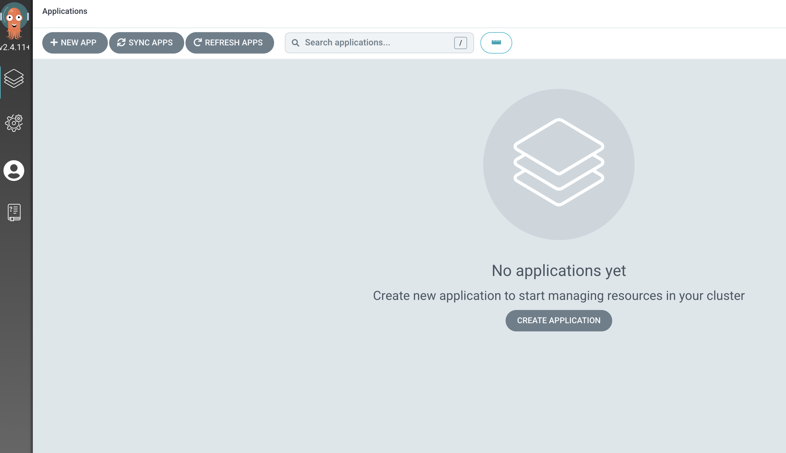
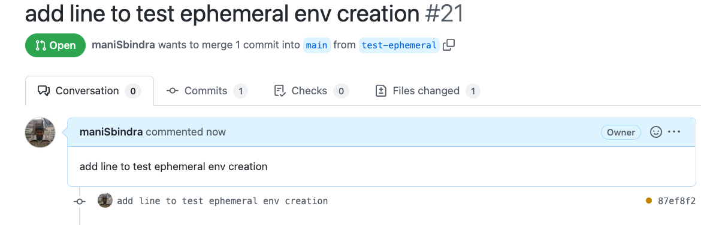
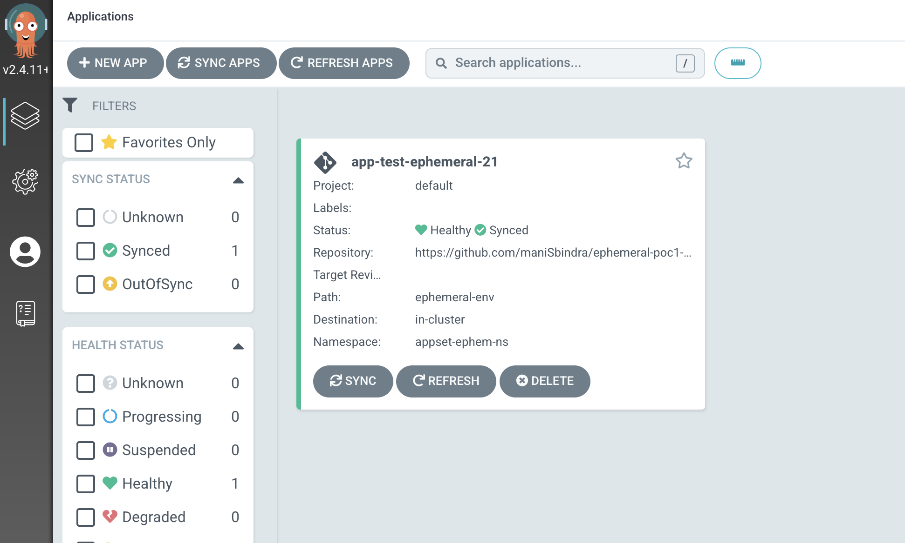
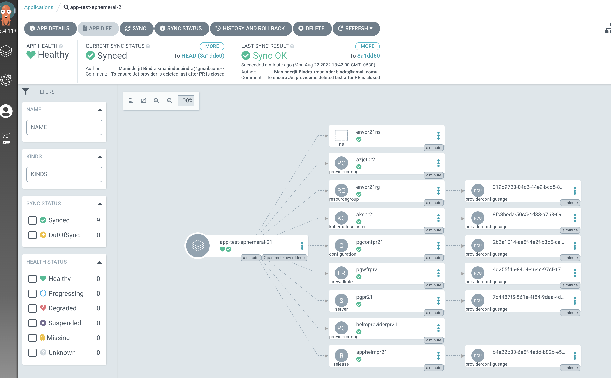
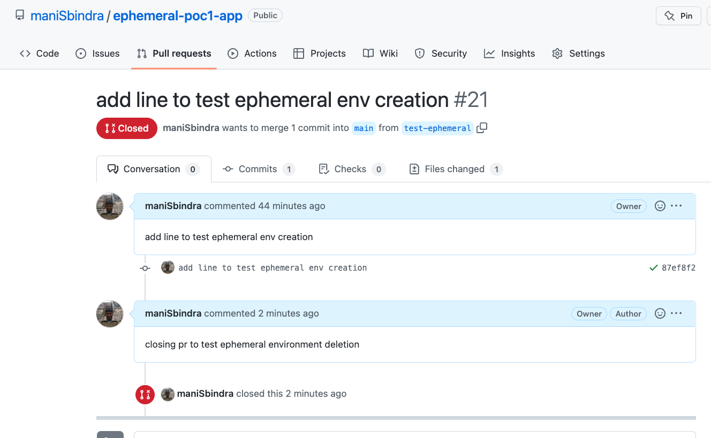
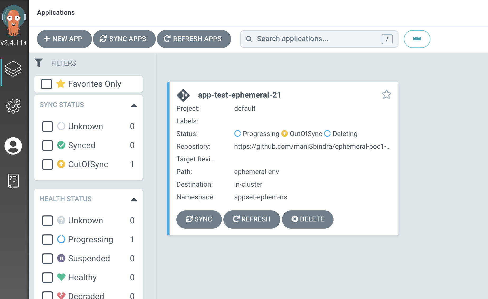
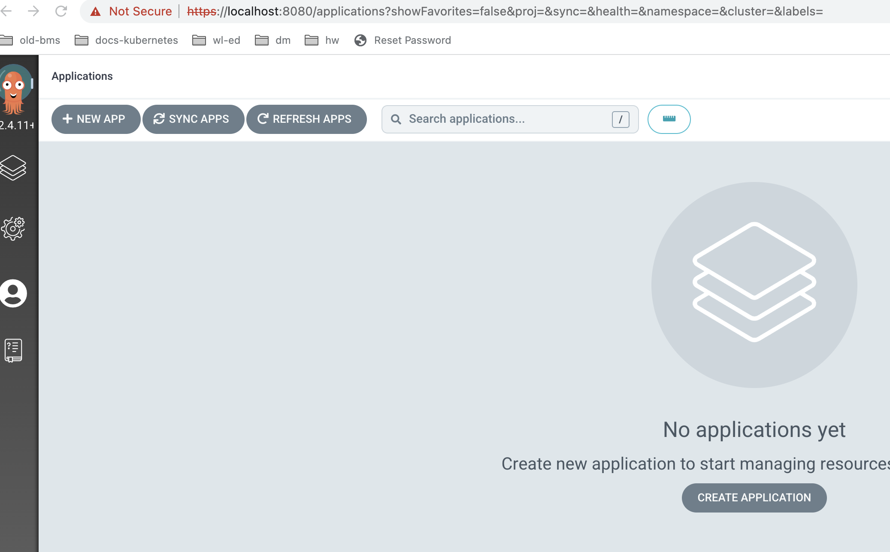

# Ephemeral Environment Setup using ArgoCD ApplicationSet (with PR Generator), Crossplane Azure Jet Provider, and Crossplane Helm Provider

## Overview
This setup is to create a Kind Cluster and create a [Argo CD ApplicationSet](argo-app-set.yaml) with Github Pull Request Generator. Once setup is done and resources are created, the controller creates (updates / deletes) a new Ephmeral environment for each PR to the [sample application repository](https://github.com/maniSbindra/ephemeral-app), which is a simple todo API (CRUD for todo items), the tech stack is Java / Springboot, and the application needs a backend postgres database. In this case an isolated environment is created for each PR, which includes a new resource group, a new AKS cluster to which the application deployment and service (corresponding to the PR SHA commit of the application) are applied, a new Azure Postgres backend database to which the application points to read and persist data.
The Environment created is based on the pull request generator configuration of the application set, which points to a helm chart based on which the environment is created. The Helm Chart repo for the configurations shown in current sample is [pr-ephemeral-env-controller](https://github.com/maniSbindra/pr-ephemeral-env-controller)

## Installation and Setup

The script [setup-mgmt-cluster.sh](https://github.com/maniSbindra/ephemeral-mgmt/blob/main/mgmt-server-install/setup-mgmt-cluster.sh) is used to setup the management cluster. Following are the prerequisites before installing this script:

### Pre-requisites

* Kind is setup on your machine
* kubectl client is installed
* helm client is installed
* kubectl crossplane plugin is installed: You can refer steps mentioned at [install crossplane](https://crossplane.io/docs/v1.9/getting-started/install-configure.html)
* argocd CLI is installed : [Install Argo CD CLI](https://argo-cd.readthedocs.io/en/stable/getting_started/#2-download-argo-cd-cli)
* Additionally we also need to create creds.json file in the same directory as the script using the command.
    ```
    az ad sp create-for-rbac --role Contributor --scopes /subscriptions/xxxxxxxx-xxxx-xxxx-xxxx-xxxxxxxxxxxx > "creds.json"
    ```
  This service principal is used by the Crossplane Azure jet provider to provision Azure resource. For more information regarding the service principal creation please see the [crossplane documentation](https://crossplane.io/docs/v1.9/getting-started/install-configure.html#get-azure-principal-keyfile)

### Setup the Management Cluster

* Clone the repo 

  ```
  git clone https://github.com/maniSbindra/ephemeral-mgmt.git
  ```

* Give script execute permissions
  ```
  cd ephemeral-mgmt/mgmt-server-install
  chmod +x setup-mgmt-cluster.sh
  ```

* Set values of environment variables : copy the file .env-template.sh to .env. Then set the values of the variables in the .env file. These variables are:
  * HELM_OCI_REGISTRY_USER and HELM_OCI_REGISTRY_PASSWORD: This Github token needs to have permissions to read and write github packages
  * POSTGRES_DB_PASSWORD: This will be used as the admin password for all ephemeral Postgres SQL Databases (one for each PR) created 
  * GITHUB_USER & GITHUB_TOKEN: This Github token will be used by argo CD, to access the app and infrastructure repositories 
  * GITHUB_APP_REPOSITORY: https://github.com/maniSbindra/ephemeral-app
  * GITHUB_INFRA_REPOSITORY: https://github.com/maniSbindra/ephemeral-env-infra.git

* Execute the script: next we execute the script
  
   ```
   ./setup-mgmt-cluster.sh
   ```
   This script should take around 4-5 minutes to execute. The last setup of this script creates the [Argo CD ApplicationSet](https://github.com/maniSbindra/ephemeral-mgmt/blob/main/mgmt-server-install/argo-app-set.yaml). 
   
### Validate the Management Cluster setup

Next we validate that the management server installation is successful.

#### Check that Argo CD and Crossplane controllers are running in the Management Cluster


Execute "kubectl get pods -A". This should show Crossplane (Azure Jet Provider and Helm Provider controllers) and ArgoCD controllers (including application set and application controllers) running as shown below

  ```
  $ kubectl get pods -A                                                                                                                            
  NAMESPACE            NAME                                                           READY   STATUS    RESTARTS   AGE
  argocd               argocd-application-controller-0                                1/1     Running   0          4m44s
  argocd               argocd-applicationset-controller-7f466f7cc-fzt4d               1/1     Running   0          4m45s
  argocd               argocd-dex-server-54cd4596c4-g2sxl                             1/1     Running   0          4m45s
  argocd               argocd-notifications-controller-8445d56d96-sdsmm               1/1     Running   0          4m45s
  argocd               argocd-redis-65596bf87-2xl7m                                   1/1     Running   0          4m45s
  argocd               argocd-repo-server-5ccf4bd568-kd9lr                            1/1     Running   0          4m45s
  argocd               argocd-server-7dff66c8f8-tcz9g                                 1/1     Running   0          4m44s
  crossplane-system    crossplane-c9b9fc9f9-lm7b6                                     1/1     Running   0          5m43s
  crossplane-system    crossplane-provider-helm-d818d26c8bf5-656d66c7-kk2ql           1/1     Running   0          5m10s
  crossplane-system    crossplane-provider-jet-azure-000558e62129-68cdf6654-lpk9m     1/1     Running   0          4m57s
  crossplane-system    crossplane-rbac-manager-56c8ff5b65-zvwsg                       1/1     Running   0          5m43s
  kube-system          coredns-64897985d-4g8jr                                        1/1     Running   0          5m43s
  kube-system          coredns-64897985d-rcb4p                                        1/1     Running   0          5m43s
  kube-system          etcd-crossplane-mgmt-fmreal-control-plane                      1/1     Running   0          5m57s
  kube-system          kindnet-2n5ph                                                  1/1     Running   0          5m43s
  kube-system          kube-apiserver-crossplane-mgmt-fmreal-control-plane            1/1     Running   0          5m57s
  kube-system          kube-controller-manager-crossplane-mgmt-fmreal-control-plane   1/1     Running   0          5m57s
  kube-system          kube-proxy-b9xm8                                               1/1     Running   0          5m43s
  kube-system          kube-scheduler-crossplane-mgmt-fmreal-control-plane            1/1     Running   0          5m56s
  local-path-storage   local-path-provisioner-5bb5788f44-wk4kr                        1/1     Running   0          5m43s
  ```

#### Verify that the app and infra repositories have been added to Argo CD 

* Login to Argo CD
  
  ```
  kubectl port-forward svc/argocd-server -n argocd 8080:443 &
  ARGOCD_ADMIN_PASS=$(kubectl -n argocd get secret argocd-initial-admin-secret -o jsonpath="{.data.password}" | base64 -d; echo)
  argocd login localhost:8080 --username admin --password $ARGOCD_ADMIN_PASS --insecure
  ```
* Verify that app and infra repositories have been added by running the command "argocd repo list". The output should be similar to
  
  ```
  $ argocd repo list                                                                                                      
  TYPE  NAME  REPO                                                         INSECURE  OCI    LFS    CREDS  STATUS      MESSAGE  PROJECT
  git         https://github.com/maniSbindra/ephemeral-env-infra.git  false     false  false  true   Successful           
  git         https://github.com/maniSbindra/ephemeral-app.git        false     false  false  true   Successful
  ```

  We are all set now let us see the ephemeral environments in action.

## Ephemeral environments in Action

### Environment Creation

* First we login to Argo CD UI using user admin. The password can be fetched using "kubectl -n argocd get secret argocd-initial-admin-secret -o jsonpath="{.data.password}" | base64 -d; echo".
* Initially when no PRs have been created we should see no application in the Argo CD UI as shown
  
* Let us now create a PR against the application Repo (https://github.com/maniSbindra/ephemeral-app.git). Once a PR has been created in a minute or so an Argo CD application corresponding to the PR will be created and visible on the Argo CD UI.
  Let us create a PR on Github
  
  In this case our PR has PR number: 21 and commit SHA short hash: 87ef8f2. As a result we see an Argo CD application being created and visible on the Argo CD UI
  
  If we drilldown into this Application on the Argo CD UI, we see overview of all the Crossplane Jet Povider and Crossplane Helm provider resources
  
  As we can see all resources created have the PR Number 21 Appended to their names. Let us drill down and look at the definition of the **apphelmpr21** resource, which is used to release the application on to the ephemeral environment
  
  ```
  apiVersion: helm.crossplane.io/v1beta1
  kind: Release
  metadata:
    annotations:
      argocd.argoproj.io/sync-wave: '10'
      crossplane.io/external-name: apphelmpr21
      kubectl.kubernetes.io/last-applied-configuration:......
    labels:
      app.kubernetes.io/instance: app-test-ephemeral-21
    name: apphelmpr21
  spec:
    deletionPolicy: Delete
    forProvider:
      chart:
        name: helm/app
        pullSecretRef:
          name: helmoci
          namespace: crossplane-system
        repository: 'oci://ghcr.io/manisbindra'
        url: 'oci://ghcr.io/manisbindra/helm/app:0.0.21'
        version: 0.0.21
      namespace: app
      set:
        - name: db.SPRING_DATASOURCE_PASSWORD
          valueFrom:
            secretKeyRef:
              key: password
              name: psql-password
              namespace: crossplane-system
      values:
        db:
          SPRING_DATASOURCE_URL: 'jdbc:postgresql://pgpr21.postgres.database.azure.com:5432/postgres'
          SPRING_DATASOURCE_USERNAME: psqladminun@pgpr21
        image:
          tag: pull-87ef8f264a79668fd4a4e68ac03d2d908ce61b57
        service:
          type: LoadBalancer
    providerConfigRef:
      name: helmproviderpr21

  ```
    What we see is that the container image being pulled for the application has the PR Commit SHA tag, and helm chart version and uri have the format 0.0.PRNumber, so the helm chart being used to deploy the application is specific to the PR. What is also interesting is the way the Postgres Database connection details are passed into the application using the psql-password kubernetes secret in the crossplane-system name space.
* We can now look at the status of crossplane created resources using the command "kubectl get crossplane".
  
  ```
  $ kubectl get crossplane                                                                                   
  NAME                                                                            HEALTHY   REVISION   IMAGE                                  STATE    DEP-FOUND   DEP-INSTALLED   AGE
  providerrevision.pkg.crossplane.io/crossplane-provider-helm-d818d26c8bf5        True      1          crossplane/provider-helm:master        Active                               44m
  providerrevision.pkg.crossplane.io/crossplane-provider-jet-azure-000558e62129   True      1          crossplane/provider-jet-azure:v0.9.0   Active                               44m

  NAME                                                       INSTALLED   HEALTHY   PACKAGE                                AGE
  provider.pkg.crossplane.io/crossplane-provider-helm        True        True      crossplane/provider-helm:master        44m
  provider.pkg.crossplane.io/crossplane-provider-jet-azure   True        True      crossplane/provider-jet-azure:v0.9.0   44m

  NAME                                              READY   SYNCED   EXTERNAL-NAME   AGE
  resourcegroup.azure.jet.crossplane.io/envpr21rg   True    True     envpr21rg       15m

  NAME                                                                               AGE   CONFIG-NAME   RESOURCE-KIND       RESOURCE-NAME
  providerconfigusage.azure.jet.crossplane.io/019d9723-04c2-44e9-bcd5-88b2994bc8e9   15m   azjetpr21     ResourceGroup       envpr21rg
  providerconfigusage.azure.jet.crossplane.io/2b2a1014-ae5f-4e2f-b3d5-ca7bc60690cb   15m   azjetpr21     Configuration       pgconfpr21
  providerconfigusage.azure.jet.crossplane.io/4d255f46-8404-464e-97cf-170a97dbb9b4   15m   azjetpr21     FirewallRule        pgwfrpr21
  providerconfigusage.azure.jet.crossplane.io/7d4487f5-561e-4f84-9daa-4d19c0a44a67   15m   azjetpr21     Server              pgpr21
  providerconfigusage.azure.jet.crossplane.io/8fc8beda-50c5-4d33-a768-698139d05664   15m   azjetpr21     KubernetesCluster   akspr21

  NAME                                                                          AGE   CONFIG-NAME        RESOURCE-KIND   RESOURCE-NAME
  providerconfigusage.helm.crossplane.io/b4e22b03-6e5f-4add-b82b-e59399fd7602   15m   helmproviderpr21   Release         apphelmpr21

  NAME                                                 AGE
  providerconfig.helm.crossplane.io/helmproviderpr21   15m

  NAME                                     CHART      VERSION   SYNCED   READY   STATE      REVISION   DESCRIPTION        AGE
  release.helm.crossplane.io/apphelmpr21   helm/app   0.0.21    True     False   deployed   31         Upgrade complete   15m

  NAME                                        AGE   TYPE         DEFAULT-SCOPE
  storeconfig.secrets.crossplane.io/default   44m   Kubernetes   crossplane-system

  NAME                                                                 READY   SYNCED   EXTERNAL-NAME   AGE
  kubernetescluster.containerservice.azure.jet.crossplane.io/akspr21   True    True     akspr21         15m

  NAME                                                    READY   SYNCED   EXTERNAL-NAME   AGE
  server.dbforpostgresql.azure.jet.crossplane.io/pgpr21   True    True     pgpr21          15m

  NAME                                                             READY   SYNCED   EXTERNAL-NAME   AGE
  firewallrule.dbforpostgresql.azure.jet.crossplane.io/pgwfrpr21   True    True     pgwfrpr21       15m

  NAME                                                               READY   SYNCED   EXTERNAL-NAME                                                                                                                                                AGE
  configuration.dbforpostgresql.azure.jet.crossplane.io/pgconfpr21   True    True     /subscriptions/9999999-999999-999999-99999/resourceGroups/envpr21rg/providers/Microsoft.DBforPostgreSQL/servers/pgpr21/configurations/array_nulls   15m
  ```  

  We can see from this that akspr21 (AKS cluster) and pgpr21 (postgres database) are now in the ready state, this means that these have been created. Let us look at these resources in the Azure Portal


### Environment Deletion

Let us now close the PR in Github



After this the Argo CD application automatically moves to the deleting state



After a few minutes when the crossplane provider has deleted all Azure resources, the Argo CD application list again becomes blank



